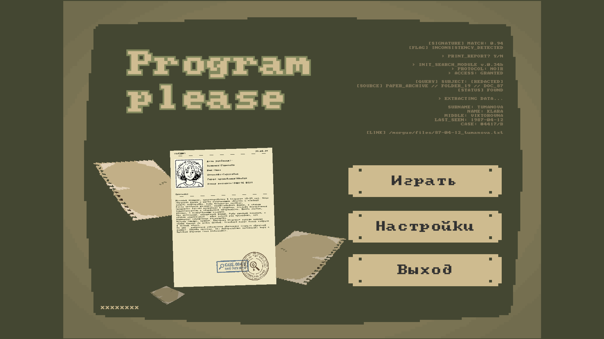
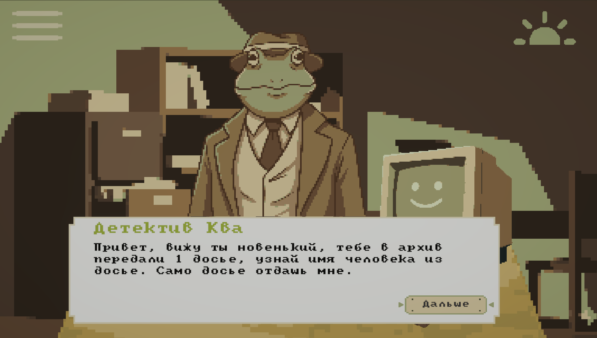
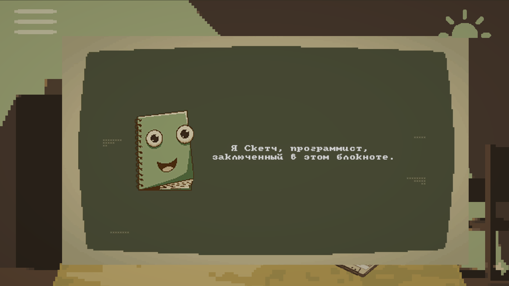
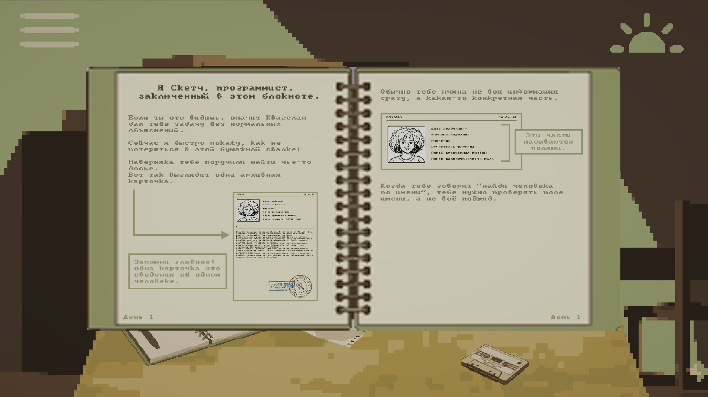
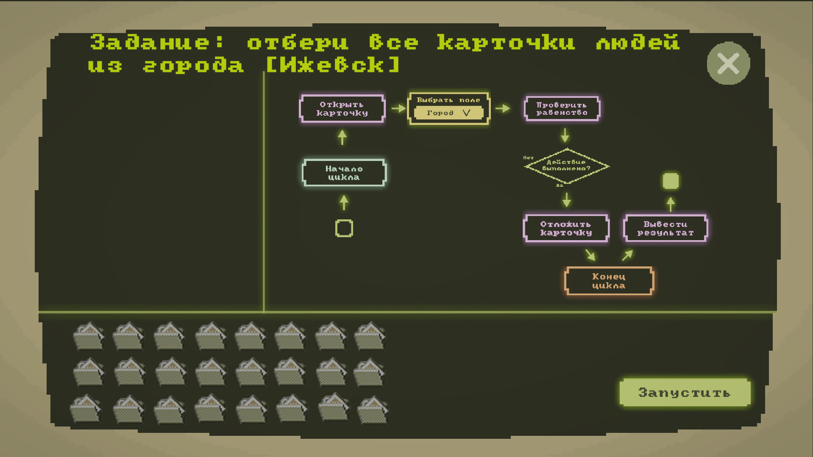
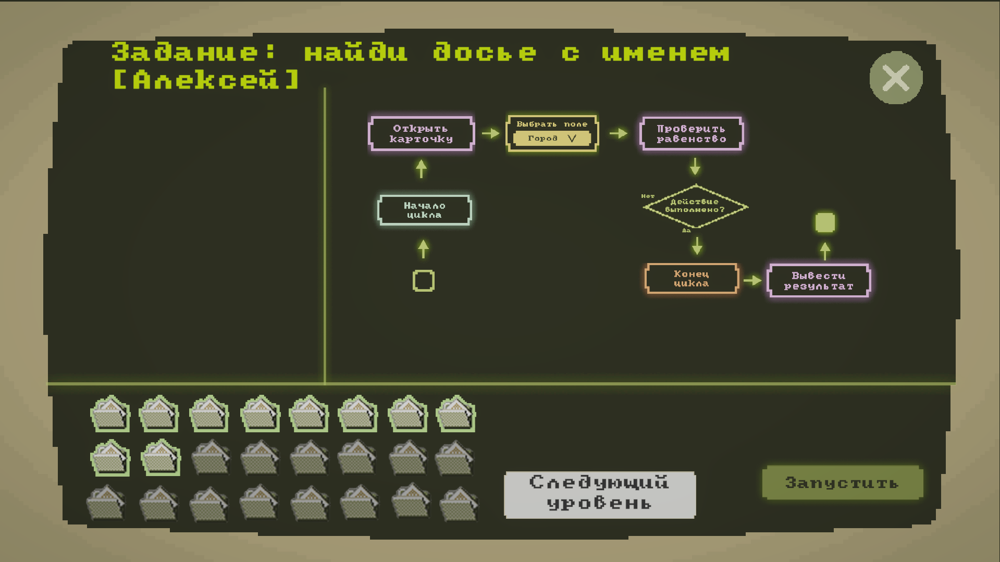

# Program, please


**Program, please** — прототип образовательной игры в жанре **narrative-driven puzzle / educational sim**, созданный в рамках хакатона **Level 21: Education Games**. Игрок выступает работником архива и решает сюжетные задачи через построение простых алгоритмов и работу с карточками-досье. Проект помогает изучать основы баз данных, декомпозицию задач и пошаговую логику через геймплей, визуальную отладку и нарратив, а не через сухую теорию.

---

## 1. Заголовок и краткое описание проекта

**Название проекта:** Program, please

**Краткое описание:**  
Program, please — это образовательная игра в стилистике ретро-детектива, в которой игрок изучает основы баз данных и алгоритмического мышления через работу с архивными карточками и визуальное построение алгоритмов. Проект создан в рамках хакатона **Level 21: Education Games** как прототип игрового решения для вовлечения подростков 13–17 лет в изучение теории через сюжет и практику.

> Статус: хакатонный игровой прототип  
> Быстрый запуск: папка `Build` → `.exe` файл  
> Подробная архитектура: [docs/ARCHITECTURE.md](./docs/ARCHITECTURE.md)
---

## 2. Установка и запуск проекта

### Вариант 1. Запуск готового билда
1. Перейдите в папку `Build`.
2. Запустите `.exe` файл игры.
3. Убедитесь, что рядом с `.exe` находятся все файлы и папки, собранные Unity вместе с билдом.

### Вариант 2. Запуск из исходников
1. Склонируйте репозиторий:
   ```bash
   git clone <ссылка_на_репозиторий>
   ```
2. Откройте проект через **Unity Hub**.
3. Выберите папку проекта как Unity-проект.
4. Дождитесь импорта зависимостей.
5. Откройте стартовую сцену и нажмите **Play**.

### Что потребуется
- **Unity**  
  Рекомендуемая версия Unity для запуска из исходников: `6000.3.10f1`.
- **Git**
- Пакеты Unity, подключенные через папку `Packages/`

### Структура проекта
- `Assets/` — сцены, скрипты, UI, игровые ассеты
- `Packages/` — пакеты Unity
- `ProjectSettings/` — настройки проекта
- `Build/` — готовый исполняемый билд

---

## 3. Основной функционал проекта

Игровой цикл в прототипе строится вокруг цепочки: брифинг → теория → практика → результат. Основной акцент сделан на практическом взаимодействии с архивными карточками и сборке алгоритма из доступных функций.
На текущем этапе в прототипе реализованы:
- основная механика взаимодействия с архивными карточками;
- визуальное обучение через игровые “дни” и практические задания;
- построение алгоритма из доступных функций;
- система моментальной обратной связи;
- визуализация выполнения алгоритма в игровом интерфейсе;
- обучение основам БД и алгоритмического мышления через нарратив и геймплей.

### Что уже работает
- основная игровая механика;
- визуальное обучение;
- обратная связь по действиям игрока.

### Что пока находится в разработке
- разбор ошибок;
- экономика;
- сюжетные ивенты;
- скрытая телеметрия прогресса.

---

## 4. Технологии и инструменты

- **Unity** — игровой движок
- **C#** — логика проекта
- **Figma** — прототипирование и дизайн интерфейсов
- **Zenject** — инфраструктурный слой композиции и внедрения зависимостей

---

## 5. Команда проекта

**Команда “UDGU_IZHGTU_ромашка_MISIS_GUAP”**

- **Кривилев Алексей** — тимлид, аналитик
- **Тюльпин Эдуард** — Unity разработчик
- **Шарычев Иван** — Unity разработчик
- **Скобкарева Софья** — 2D дизайнер
Команда сформирована на базе совместного участия в хакатонах и обучения в IT-академии Калашникова.

### Контакты
- **Тюльпин Эдуард** — `@XEdyardx`, `tulpin.ed@yandex.ru`

---

## 6. Архитектура и структура проекта

### Архитектурный подход
В проекте используется **Zenject** как архитектурный слой композиции. Он нужен для связывания игровых систем, сервисов и runtime-объектов через контейнер зависимостей, а не через жесткие ссылки между `MonoBehaviour`, синглтоны и ручную инициализацию в сценах.

Такой подход позволяет:
- сделать зависимости явными;
- уменьшить связанность между подсистемами;
- упростить развитие и замену модулей;
- централизованно управлять жизненным циклом объектов.

**Подробнее об архитектуре:** [docs/ARCHITECTURE.md](./docs/ARCHITECTURE.md)
Полный разбор архитектурного слоя, контекстов, точки входа и системы сохранений вынесен в отдельный файл, чтобы основной README оставался компактным.

### Контексты приложения
Проект разделен на несколько уровней контекстов:
- **Project Context** — глобальные зависимости на весь жизненный цикл приложения;
- **Scene Context** — зависимости конкретной сцены;
- **Object Context** — инкапсуляция механик внутри отдельных игровых сущностей.

### Точка входа
В проекте используется единая программная точка входа через `UnityApplicationBuilder` и `UnityApplication`, что позволяет централизованно настраивать конфигурацию и зависимости перед запуском основной логики приложения.

### Система сохранений
Система сохранений привязана к контекстной архитектуре приложения. Для управления данными используются:
- глобальный контекст;
- контекст ячейки сохранения;
- контекст сцены.

Это позволяет поддерживать понятную структуру хранения и разделять данные по уровню их жизни в приложении.

### Структура папок
- `Assets/` — игровые сцены, логика, UI, ресурсы
- `Packages/` — зависимости Unity
- `ProjectSettings/` — настройки проекта
- `Build/` — исполняемый билд
- `docs/` — документация и скриншоты
- `README.md` — описание проекта
- `LICENSE` — лицензия

---

## 7. Демонстрация работы проекта

### Главное меню


### Сюжетная подача


### Обучение и объяснение механики через видео 


### Обучение через “записную книжку”


### Практический экран


### Экран фильтрации


### Демо
На данный момент демонстрация проекта доступна через готовый Unity-билд в папке `Build`.

---

## 8. Финальный текст-заключение

Мы хотели сделать игру, где сухая теория превращается в увлекательное расследование, а изучение алгоритмов и основ баз данных становится естественной частью сюжета. В отличие от обычной учебной подачи, игрок не просто читает теорию, а применяет ее на практике, получает мгновенную обратную связь и видит, как его логика работает внутри игрового мира.

В дальнейшем проект можно развивать в сторону:
- полноценного режима разбора ошибок;
- экономики и метапрогрессии;
- сюжетных событий;
- скрытой телеметрии обучения;
- расширения набора игровых “дней” и типов задач;
- адаптации сложности под уровень игрока.

Проект показывает, что даже сложные для первого знакомства темы можно объяснять через интерактивную среду, сюжет и пошаговую визуализацию действий игрока.

---

## 9. Статус проекта

Проект находится в стадии игрового прототипа, созданного в рамках хакатона. На текущем этапе реализованы основная механика, визуальное обучение, базовые игровые “дни” и система обратной связи. Часть систем — например, разбор ошибок, экономика и сюжетные ивенты — пока находятся на уровне проектирования и будут развиваться в следующих итерациях.

---

## 10. Лицензия

Проект распространяется под лицензией **MIT**.
